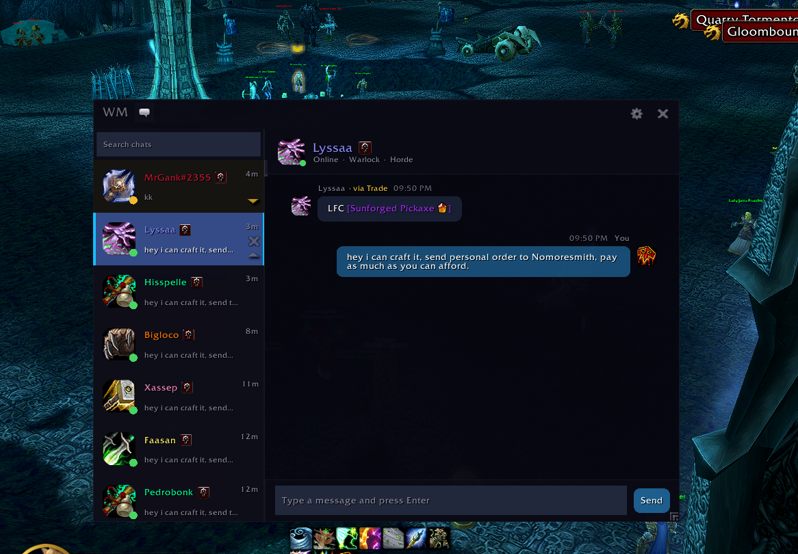

# WhisperMessenger

[](https://github.com/F0rty-Tw0/WhisperMessenger/releases/latest)
[](https://github.com/F0rty-Tw0/WhisperMessenger/releases/latest)
[](https://github.com/F0rty-Tw0/WhisperMessenger/actions/workflows/ci.yml)

A messenger-style whisper UI for World of Warcraft. Replaces the default whisper chat with a modern conversation interface — contact list, chat bubbles, unread badges, and more.



> [!WARNING]
> **Whispers are disabled by Blizzard during competitive content.**
> WoW blocks all addon whisper communication during Mythic+ dungeons, rated Battlegrounds, and raid boss encounters. This is a game-level restriction — not a limitation of WhisperMessenger. The addon automatically detects these situations, suspends itself, and resumes when you're done.

## Features

### Messenger-Style Conversations

Chat bubbles with timestamps, date separators, and sender labels — just like a real messenger app. Right-click any bubble to copy its text.

### Contact List

Scrollable contact list with online status dots, unread message badges, and last-message previews. Drag contacts to reorder them. Search across names and message history with live filtering.

### Battle.net Integration

Seamlessly handles both character whispers and Battle.net friend whispers. Contact details stay in sync with your friends list in real time.

### Theme Presets

Switch between multiple visual themes — Default, Midnight, Shadowlands, and Draenor — from the Appearance settings. Themes apply instantly with no reload required.

### Font Customization

Choose from Default (Friz Quadrata), System (Arial Narrow), or Custom (inherits fonts from addons like ElvUI).

### Smart Notifications

Configurable notification sounds (Whisper, Ping, Chime, Bell, Raid Warning) that play even when in-game audio is muted.

### Auto-Open Window

Automatically opens the messenger when you receive a whisper, right-click "Whisper" on a player, or click a name to whisper — configurable in Behavior settings, disabled during combat.

### Mythic+ Awareness

Automatically suspends during Mythic+ dungeons and Mythic raids. Your window hides and restores when you leave. Whispers fall through to the default chat during this time.

### Quest & Item Linking

Shift-click quests, achievements, spells, and professions to link them directly into the messenger chat.

### Settings

Full settings panel with General, Appearance, Behavior, and Notification tabs. Includes a profanity filter toggle, hide-from-default-chat option, and auto-focus control.

## Compatibility

WhisperMessenger works on **all WoW flavors**:

| Flavor                    | Status    |
| ------------------------- | --------- |
| Retail (Mainline)         | Supported |
| Classic Era               | Supported |
| Season of Discovery       | Supported |
| TBC Classic Anniversary   | Supported |
| Cataclysm Classic         | Supported |
| Mists of Pandaria Classic | Supported |

A single install covers every client — WoW automatically loads the correct version.

## Download

### CurseForge (Recommended)

Install via the [CurseForge App](https://www.curseforge.com/wow/addons/whispermessenger) for automatic updates.

### Wago

Also available on [Wago Addons](https://addons.wago.io/addons/whispermessenger).

### GitHub Releases

Download the latest ZIP from [GitHub Releases](https://github.com/F0rty-Tw0/WhisperMessenger/releases/latest) and extract it into your `Interface/AddOns/` folder.

## Configuration

Open the settings panel by clicking the gear icon in the messenger window, or type:

```
/wmsg
```

## Contributing

Pull requests are welcome! The project uses Lua 5.1 with StyLua for formatting and Luacheck for static analysis.

### Lint

```bash
bash scripts/lint.sh          # check
bash scripts/lint.sh --fix    # auto-format + check
```

#### Windows local setup

```powershell
powershell -ExecutionPolicy Bypass -File scripts/setup-lint-tools.ps1
bash scripts/lint.sh
```

### Tests

```bash
# Run a single test file
lua tests/run.lua tests/path/to/test_file.lua

# Run all tests
for f in tests/**/*.lua; do lua tests/run.lua "$f"; done
```

Both lint and tests must pass before merging.

## License

All rights reserved. See the [LICENSE](LICENSE) file for details.
