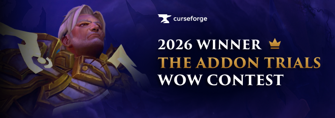

<p align="center">
  <a href="https://mod.curseforge.com/modding-contests/wow_midnight-addon_contest/">
    
  </a>
</p>

<h1 align="center">WhisperMessenger</h1>

<p align="center">
  <a href="https://github.com/F0rty-Tw0/WhisperMessenger/releases/latest"></a>
  <a href="https://github.com/F0rty-Tw0/WhisperMessenger/releases/latest"></a>
  <a href="https://github.com/F0rty-Tw0/WhisperMessenger/actions/workflows/ci.yml"></a>
</p>

<p align="center">
  <b>Never lose a whisper again.</b><br>
  Every conversation lands in one messenger window with history, online status and unread badges, like the messenger you already use, inside World of Warcraft.
</p>

<p align="center">
  🏆 5th place in <a href="https://mod.curseforge.com/modding-contests/wow_midnight-addon_contest/">The Addon Trials</a>, CurseForge's 2026 WoW addon contest.
</p>


## Why players install it

- **Whispers stop drowning in raid, trade and guild spam.** Each person gets their own conversation with an unread badge, so you always know who is waiting on you.
- **Yesterday's conversation is still there.** History survives logout and is shared across your characters.
- **See who is online and where before you whisper.** Class, faction, zone and Battle.net status sit right in the contact list.
- **Battle.net and character whispers, side by side.** No more guessing which tab a friend wrote in.

## "Can't I just make a Whispers chat tab?"

You can, and it helps. A tab still mixes everyone into one scrolling stream, forgets everything on logout, has no unread count per person and no online status. WhisperMessenger gives every person their own thread with all of that.

## Features

### Messenger-Style Conversations

Chat bubbles with timestamps, date separators and sender labels. Right-click any message to copy it or add a reaction. An emoji picker sits next to the message box.

### Contact List

Online status dots, unread badges, last-message previews, and the zone or dungeon a friend is in. Pin and drag contacts to reorder them. Search across names and message history.

### Whispers and Groups

The **Whispers** tab holds your private conversations. The **Groups** tab collects party, raid, instance and guild chat, with reactions there too.

### Battle.net Integration

Character whispers and Battle.net friend whispers live in one list. Contact details stay in sync with your friends list in real time.

### Friends Who Also Use It

When a friend also runs WhisperMessenger you get typing indicators, "Seen" receipts and reactions attached to the original message. Both can be switched off in Behavior settings. Players without the addon still receive a readable plain-text fallback.

### Themes

A modern, clean look with five color themes: **Midnight**, **Shadowlands**, **Draenor**, **Pandaria** and **Azeroth**. Prefer the game's own style? Turn on **Native WoW HUD** for a classic Blizzard frame. Themes apply instantly, no reload.

### Fonts and Scale

Pick the default font or any font from SharedMedia addons like ElvUI. Resize the whole window from 75% to 150%.

### Notifications

Choose a sound (Whisper, Ping, Chime, Bell, Raid Warning) that plays even when in-game audio is muted.

### Auto-Open Window

Opens the messenger when you receive a whisper, pick "Whisper" on a player, or click a name. Configurable in Behavior settings, and never during combat.

### Linking

Shift-click items, quests, achievements, spells and professions to link them straight into your message.

### Settings

Pages for **General**, **Appearance**, **Behavior**, **Notifications**, **Icons** and **What's New**. Includes a profanity filter toggle, a hide-from-default-chat option and auto-focus control.

## Good to know

Blizzard blocks all addon whisper communication during Mythic+ dungeons, rated Battlegrounds and raid boss encounters. This is a game-level restriction, not a limitation of WhisperMessenger. The addon detects these situations, steps aside so whispers fall through to the default chat, and resumes when you're done.

## Compatibility

WhisperMessenger works on **all WoW flavors**:

| Flavor                    | Status    |
| ------------------------- | --------- |
| Retail (Mainline)         | Supported |
| Classic Era               | Supported |
| Season of Discovery       | Supported |
| TBC Classic Anniversary   | Supported |
| Cataclysm Classic         | Supported |
| Mists of Pandaria Classic | Supported |
| WoW: Forever              | Beta      |

A single install covers every client. WoW loads the correct version automatically.

## Download

### CurseForge (Recommended)

Install via the [CurseForge App](https://www.curseforge.com/wow/addons/whisper-messenger) for automatic updates.

### Wago

Also available on [Wago Addons](https://addons.wago.io/addons/whispermessenger).

### GitHub Releases

Download the latest ZIP from [GitHub Releases](https://github.com/F0rty-Tw0/WhisperMessenger/releases/latest) and extract it into your `Interface/AddOns/` folder.

## Configuration

Open settings with the gear icon in the messenger window, or type:

```
/wmsg
```

## Contributing

Pull requests are welcome! The project uses Lua 5.1 with StyLua for formatting and Luacheck for static analysis.

### Lint

```bash
bash scripts/lint.sh          # check
bash scripts/lint.sh --fix    # auto-format + check
```

#### Windows local setup

```powershell
powershell -ExecutionPolicy Bypass -File scripts/setup-lint-tools.ps1
bash scripts/lint.sh
```

### Tests

```bash
# Run a single test file
lua tests/run.lua tests/path/to/test_file.lua

# No Lua on Windows? Use the Python + lupa harness
python scripts/run_test.py tests/path/to/test_file.lua

# Run all tests
for f in tests/**/*.lua; do lua tests/run.lua "$f"; done
```

Both lint and tests must pass before merging.

## License

All rights reserved. See the [LICENSE](LICENSE) file for details.
