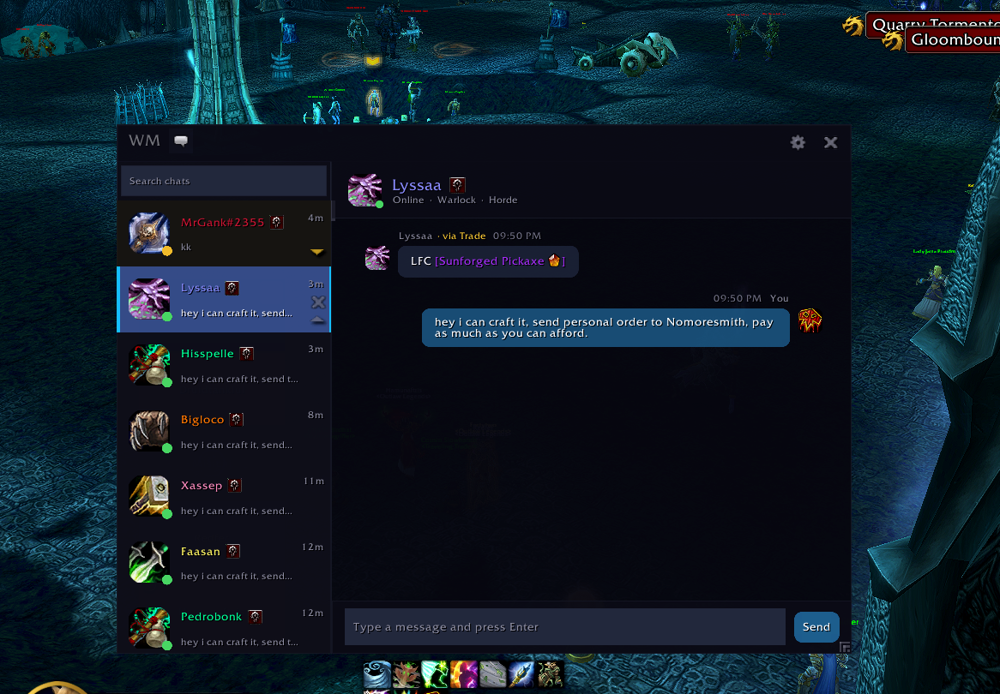

# WhisperMessenger

[](https://github.com/F0rty-Tw0/WhisperMessenger/releases/latest)
[](https://github.com/F0rty-Tw0/WhisperMessenger/releases/latest)
[](https://github.com/F0rty-Tw0/WhisperMessenger/actions/workflows/ci.yml)

**Never lose a whisper again.** Every conversation lands in one messenger window with history, online status and unread badges — like the messenger you already use, inside World of Warcraft.



## Why players install it

- **Whispers stop drowning in raid, trade and guild spam.** Each person gets their own conversation with an unread badge, so you always know who is waiting on you.
- **Yesterday's conversation is still there.** History survives logout and is shared across your characters.
- **See who is online and where before you whisper.** Class, faction, zone and Battle.net status sit right in the contact list.
- **Battle.net and character whispers, side by side.** No more guessing which tab a friend wrote in.

## "Can't I just make a Whispers chat tab?"

You can, and it helps. A tab still mixes everyone into one scrolling stream, forgets everything on logout, has no unread count per person and no online status. WhisperMessenger gives every person their own thread with all of that.

## Features

### Messenger-Style Conversations

Chat bubbles with timestamps, date separators, and sender labels — just like a real messenger app. Right-click any bubble to copy its text or add a reaction.

### Contact List

Scrollable contact list with online status dots, unread message badges, and last-message previews. Drag contacts to reorder them. Search across names and message history with live filtering.

### Battle.net Integration

Seamlessly handles both character whispers and Battle.net friend whispers. Contact details stay in sync with your friends list in real time.

### Friends Who Also Use It

When a friend also runs WhisperMessenger you get typing indicators, "Seen" receipts and reactions attached to the original message. Players without the addon still receive a readable plain-text fallback.

### Theme Presets

Switch between multiple visual themes — Default, Midnight, Shadowlands, and Draenor — from the Appearance settings. Themes apply instantly with no reload required.

### Font Customization

Choose from Default (Friz Quadrata), System (Arial Narrow), or any font provided by SharedMedia addons like ElvUI.

### Smart Notifications

Configurable notification sounds (Whisper, Ping, Chime, Bell, Raid Warning) that play even when in-game audio is muted.

### Auto-Open Window

Automatically opens the messenger when you receive a whisper, right-click "Whisper" on a player, or click a name to whisper — configurable in Behavior settings, disabled during combat.

### Quest & Item Linking

Shift-click quests, achievements, spells, and professions to link them directly into the messenger chat.

### Settings

Full settings panel with General, Appearance, Behavior, and Notification tabs. Includes a profanity filter toggle, hide-from-default-chat option, and auto-focus control.

## Good to know

Blizzard blocks all addon whisper communication during Mythic+ dungeons, rated Battlegrounds, and raid boss encounters. This is a game-level restriction, not a limitation of WhisperMessenger. The addon detects these situations, steps aside so whispers fall through to the default chat, and resumes when you're done.

## Compatibility

WhisperMessenger works on **all WoW flavors**:

| Flavor                    | Status    |
| ------------------------- | --------- |
| Retail (Mainline)         | Supported |
| Classic Era               | Supported |
| Season of Discovery       | Supported |
| TBC Classic Anniversary   | Supported |
| Cataclysm Classic         | Supported |
| Mists of Pandaria Classic | Supported |

A single install covers every client — WoW automatically loads the correct version.

## Download

### CurseForge (Recommended)

Install via the [CurseForge App](https://www.curseforge.com/wow/addons/whispermessenger) for automatic updates.

### Wago

Also available on [Wago Addons](https://addons.wago.io/addons/whispermessenger).

### GitHub Releases

Download the latest ZIP from [GitHub Releases](https://github.com/F0rty-Tw0/WhisperMessenger/releases/latest) and extract it into your `Interface/AddOns/` folder.

## Configuration

Open the settings panel by clicking the gear icon in the messenger window, or type:

```
/wmsg
```

## Contributing

Pull requests are welcome! The project uses Lua 5.1 with StyLua for formatting and Luacheck for static analysis.

### Lint

```bash
bash scripts/lint.sh          # check
bash scripts/lint.sh --fix    # auto-format + check
```

#### Windows local setup

```powershell
powershell -ExecutionPolicy Bypass -File scripts/setup-lint-tools.ps1
bash scripts/lint.sh
```

### Tests

```bash
# Run a single test file
lua tests/run.lua tests/path/to/test_file.lua

# Run all tests
for f in tests/**/*.lua; do lua tests/run.lua "$f"; done
```

Both lint and tests must pass before merging.

## License

All rights reserved. See the [LICENSE](LICENSE) file for details.
